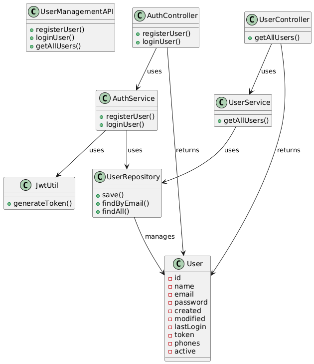
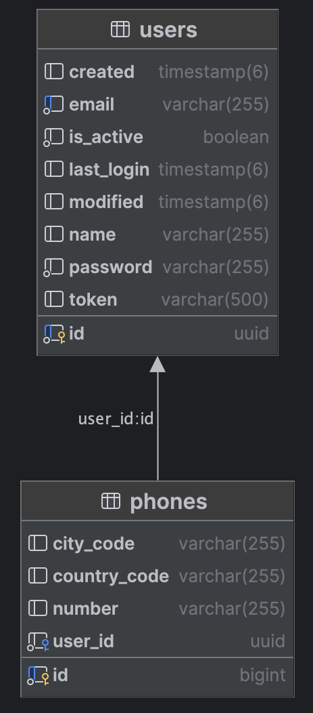

# User Management API

## Features

- User registration and authentication
- JWT-based authentication
- User management with pagination
- Persistence with JPA
- Swagger UI for API documentation
- Secure endpoints with Spring Security
- Example responses in Swagger UI

## Technologies

- Java [21]
- Spring Boot [3.2.5]
- Spring Security
- JWT
- Swagger
- Gradle
- PostgreSQL

### API Diagram



### DB Diagram



## Configuration

1. **Clone the repository:**

    ```sh
    git clone https://github.com/anibalventura/user-management-api.git
    cd user-management-api
    ```

   2. **Configure application properties:**

       Update the `src/main/resources/application.properties` file with your database and JWT configurations.

       ```properties
       # Database Configuration
       spring.application.name=user-management-api
       spring.datasource.url=jdbc:postgresql://localhost:5432/usermanagementdb
       spring.datasource.username=postgres
       spring.datasource.password=postgres
       spring.jpa.properties.hibernate.dialect=org.hibernate.dialect.PostgreSQLDialect
       spring.jpa.hibernate.ddl-auto=update
    
       # JWT Configuration
       jwt.secret="u8Jz7Fh2J3kL9mN4pQ6rT8vW0xY2zA5B7D1E3G5H7J9K1L3N5P7R9T1V3X5Z7"
       jwt.expiration=86400000
       ```

3. **Build the project:**

    ```sh
    ./gradlew build
    ```

## Running the Application

1. **Run the application:**

    ```sh
    ./gradlew bootRun
    ```

2. **Access the Swagger UI:**

    Open your browser and navigate to `http://localhost:8080/swagger-ui.html` to view the API documentation and test the endpoints.

## Endpoints

- **Authentication:**
  - `POST /api/auth/register` - Register a new user
  - `POST /api/auth/login` - Login a user and return a JWT token

- **User Management:**
  - `GET /api/users` - Get all users with pagination

## Example Requests

- **Register a new user:**

    ```json
    POST /api/auth/register
    {
        "name": "Anibal Ventura",
        "email": "contact@anibalventura.com",
        "password": "password123!",
        "phones": [
            {
                "number": "9724459",
                "cityCode": "1",
                "countryCode": "809"
            }
        ]
    }
    ```

- **Login a user:**

    ```json
    POST /api/auth/login
    {
        "email": "contact@anibalventura.com",
        "password": "password123!"
    }
    ```

## Security

- The application uses JWT for securing endpoints.
- The `SecurityConfig` class configures the security settings, allowing public access to authentication and Swagger endpoints, while securing other endpoints.

## License

This project is licensed under the MIT License.